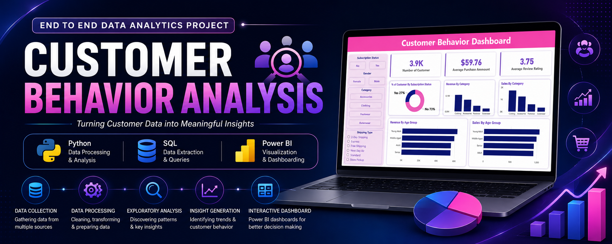
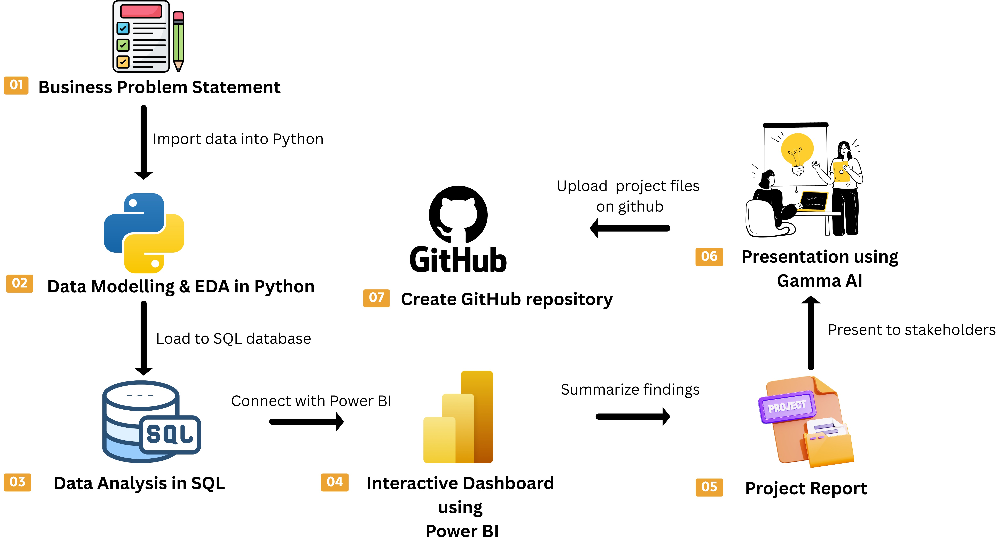
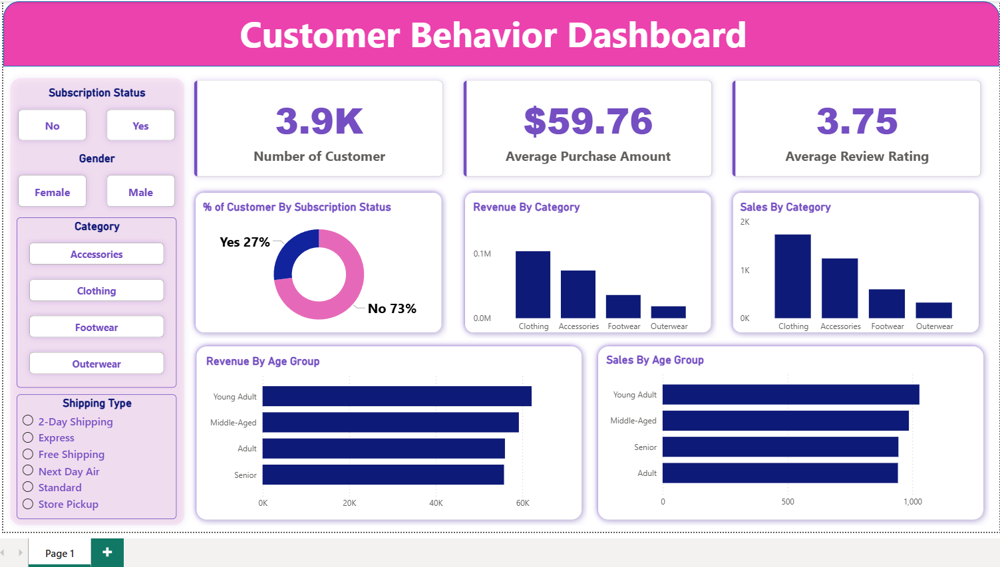

# 📊 Customer Behavior Analysis

> ### 🚀 End-to-End Data Analytics Project using Python, SQL & Power BI



---

## 📌 Project Overview

Customer Behavior Analysis is an end-to-end data analytics project that analyzes customer purchasing patterns, demographics, subscription behavior, and sales trends. Using **Python**, **SQL**, and **Power BI**, the project transforms raw customer data into interactive dashboards and actionable business insights.

---

## 🎯 Business Problem

A retail company wants to understand customer shopping behavior to improve sales, customer retention, and marketing strategies through data-driven decision-making.

---

# 🔄 Project Workflow

<p align="center">
  
</p>

This project follows a complete end-to-end analytics pipeline:

1. 📄 Define the Business Problem
2. 🐍 Perform Data Cleaning & EDA using Python
3. 🗄️ Analyze Business Questions using SQL
4. 📊 Build Interactive Dashboard in Power BI
5. 📝 Generate Business Report
6. 🎤 Present Insights using Gamma AI
7. 📂 Publish Project on GitHub

---

# 📊 Dashboard Preview

<p align="center">
  
</p>

---

# 🛠 Tech Stack

| Technology | Purpose |
|------------|---------|
| 🐍 Python | Data Cleaning & EDA |
| 🗄 SQL | Business Analysis |
| 📊 Power BI | Dashboard & Visualization |
| 🐼 Pandas | Data Manipulation |
| 🔢 NumPy | Numerical Operations |
| 💻 Git & GitHub | Version Control |

---

# ✨ Dashboard Features

- 👥 Customer Analysis
- 💰 Revenue Analysis
- 📦 Category-wise Sales
- ⭐ Customer Rating Analysis
- 👤 Age Group Analysis
- 🎯 Subscription Analysis
- 📈 Interactive Filters

---

# 📈 Key Insights

- 📦 Clothing generated the highest revenue.
- 💵 Average purchase amount is **$59.76**.
- ⭐ Average customer rating is **3.75**.
- 👥 Most customers are non-subscribers.
- 🎯 Young Adults contribute the highest revenue.
- 🔥 Loyal customers form the largest customer segment.

---

# 📁 Project Structure

```text
Customer-Behavior-Analysis
│
├── Images
│   ├── banner.png
│   ├── dashboard.png
│   └── project_workflow.png
│
├── Dataset
├── SQL
├── Python
├── Power BI
├── Report
├── Presentation
└── README.md
```

---

## ⭐ If you like this project, don't forget to Star the repository!
